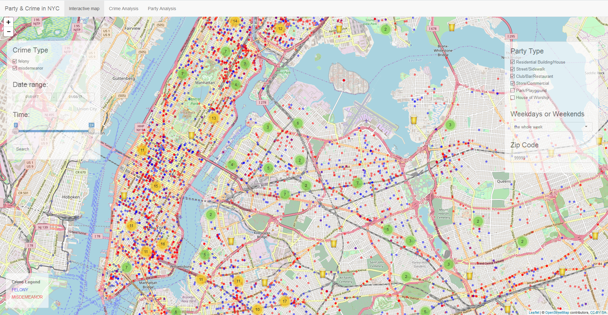

# Project 2: Open Data App - an RShiny app development project

### [Project Description](doc/project2_desc.md)


## Project Title "Where to Party?"
Term: Spring 2018


+ Team #02

	+ team member 1: Keran Li
	+ team member 2: Xinlei Cao
	+ team member 3: Mengqi Chen
	+ team member 4: Xinrou Li
	+ team member 5: Xiaochen Fan

+ **Project summary**: 
This project mainly focuses on the relation between parties and crimes. Our shiny app is desiged to help people find the safest place to have a party. And We tried to give people who are interested in organizing or joining the parties some suggestion about 

(1)	What type of parties is most popular?
(2)	Where are the locations that fewer crimes will affect the parties?
(3) For an exact zipcode location and time date, how many parties and crimes happped there during year 2017?
(4) For some fixed party types, where were they held during year 2017?

We visualize the information about parties and crimes using histogram, pie plot, geograph and the time series plot using ggplot package.
And we visualize the combination of the information about parties and crimes on NYC map using leaflet package.




Our Targer Users:
1.	Taxi driver
2.	NYPD
3.	People want to hold or join a party
4.	People who want to find a quiet and safe place


In this second project of GR5243 Applied Data Science, we develop an *Exploratory Data Analysis and Visualization* shiny app on a topic of your choice using U.S. government open data released on the [data.gov](https://data.gov/) website and (https://opendata.cityofnewyork.us). See [Project 2 Description](doc/project2_desc.md) for more details.  

The **learning goals** for this project is:

- business intelligence for data science
- data cleaning
- data visualization
- systems development/design life cycle
- shiny app/shiny server

*The above general statement about project 2 can be removed once you are finished with your project. It is optional.


+ **Contribution statement**:

Mengqi Chen: Grasped and cleaned "party" data; and in charge of the summary of party data including a bar map, histograms showing the number of parties in months and the location type of parties in boroughs.

Xiaochen Fan: Processed "crime" data, make it easier to be plotted on the map. Selected data according to the crime type and inputted time and data range. Used leaflet to plot crime data on the map.

Keran Li: Cleaned and narrowed "nypd17" dataset and "felonyint" dataset. Did the visualization of party data including pieplot, the yearly change of felony, the crime number for boroughs, and the overlap lacation of party and crime by using leaflet and ggplot. And helped integrate and code the final shiny app.

Xinlei Cao: Data cleaning and processing including the conversion of format, etc.; Build parts of the UI interface of the interactive map(the ui.R); Coding and realization of parts of algorithms of the interactive map including the visualization of the data of parties in NYC and the data of crime(the server.R).

Following [suggestions](http://nicercode.github.io/blog/2013-04-05-projects/) by [RICH FITZJOHN](http://nicercode.github.io/about/#Team) (@richfitz). This folder is orgarnized as follows.

```
proj/
├── app/
├── lib/
├── data/
├── doc/
└── output/
```

Please see each subfolder for a README file.

